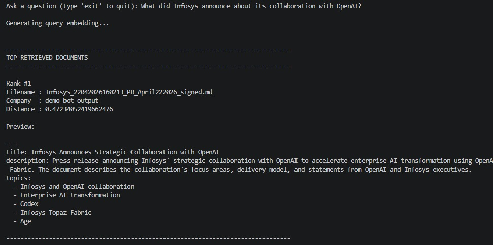
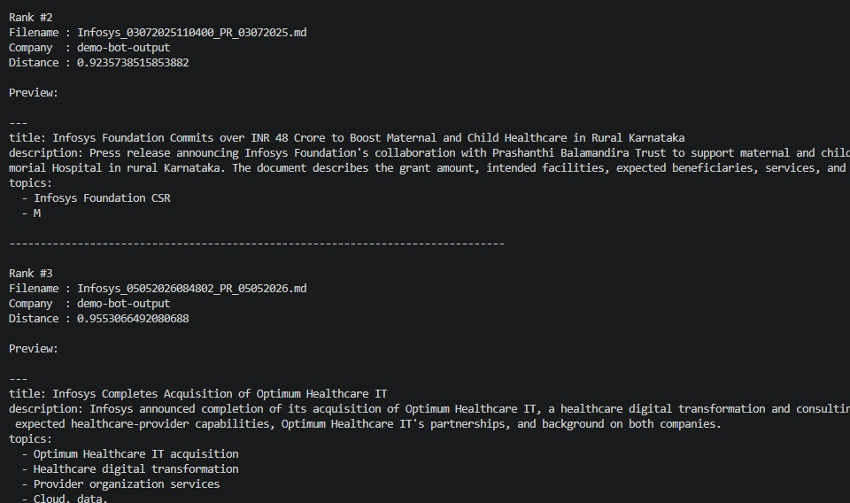
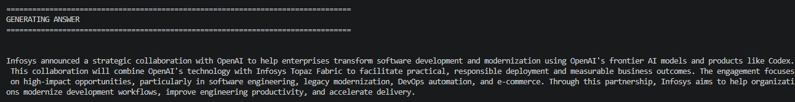

# **Data Science and AI Lab**

### **T2 - 2026**

# **FinQuery: An AI-powered, Stock-Specific Public Update Analyzer (PUA) for Indian Capital Markets**

## **Milestone-3**

**Submitted by:**

**Team 06** \
    Akbar Ali \- 23f1002997 \
    Gurram Sai Sri Ram Hruthik \- 22f3001648 \
	NandanReddy Parnapalli \- 22f3002857 \
	Shubham Gattani \- 21f3002082 \
	Shubhashish Biswas \- 21f1001460 

---

## **Contents**

1. [Dataset Organization](#1-dataset-organization)
2. [Preprocessing Pipeline](#2-preprocessing-pipeline)
3. [RAG System Architecture](#3-rag-system-architecture)
4. [Matching Processed Data to the Model's Expected Input](#4-matching-processed-data-to-the-models-expected-input)
5. [Why This Architecture](#5-why-this-architecture)
6. [Small-Scale End-to-End Pipeline Verification](#6-small-scale-end-to-end-pipeline-verification)

---

# **1. Dataset Organization**

## **1.1 Recap of Sources**

The corpus continues to draw on the four Infosys-related public sources introduced in Milestone-2: NSE corporate-announcement filings, Infosys investor-relations (IR) material, Yahoo Finance news articles, and Trendlyne brokerage reports, all restricted to a rolling twelve-month window for the pilot company (NSE: INFY). Milestone-3 focuses on how this raw material is organized on disk, how it is turned into model-ready text, and on demonstrating that the retrieval pipeline built on top of it works end to end.

## **1.2 Raw vs. Processed Directory Structure**

Each source keeps raw and processed artifacts in clearly separated folders so that every processed file can be traced back to the PDF it came from. The table below summarizes the raw input and final processed (retrieval-ready) output location for each source.

| Source | Raw input | Processed (retrieval-ready) output |
| --- | --- | --- |
| NSE filings (≤10 pages) | `data/nse_files_final/categorisation_by_pages/equal_or_less_than_10_pages` | `data/nse_files_final/whole_document_cleaning/equal_or_less_than_10_pages` |
| NSE filings (>10 pages) | `data/nse_files_final/categorisation_by_pages/more_than_10_pages` | `data/nse_files_final/knowledge_extraction/greater_than_10_pages/cleaned_section_files` (sectioned via `sectioned_files`) |
| Infosys IR documents | `data/infosys_earning_calls_press_conf_fact_sheets_results` | `data/infosys_earning_calls_press_conf_fact_sheets_results/infosys_ir_earning_calls_clean_markdowns` |
| Yahoo Finance articles | `data/yfinance/pdfs` | `data/yfinance/clean-mds` |
| Trendlyne brokerage reports | `data/trendlyne/pdfs` | `data/trendlyne/clean-mds` |
| Demo verification subset | `data/demo-bot-data` | `data/demo-bot-output` |

The full directory tree, annotated by role, is:

```text
Group-6-DS-and-AI-Lab-Project/
├── data/
│   ├── demo-bot-data/                              # RAW  – 10 demo NSE filings (Markdown, pre-cleaning)
│   ├── demo-bot-output/                            # PROCESSED – 10 cleaned demo Markdown files (embedded for verification)
│   ├── infosys_earning_calls_press_conf_fact_sheets_results/
│   │   ├── *.md                                    # RAW  – Docling output for 16 IR documents
│   │   └── infosys_ir_earning_calls_clean_markdowns/  # PROCESSED – 16 cleaned IR Markdown files
│   ├── nse_files_final/
│   │   ├── keep/                                   # RAW (post rule-based filter) – 65 files
│   │   ├── final_categorisation_by_gpt-5.5/accepted_by_gpt/  # RAW (post LLM review) – 72 files
│   │   ├── categorisation_by_pages/
│   │   │   ├── equal_or_less_than_10_pages/         # RAW split by page count – 109 files
│   │   │   └── more_than_10_pages/                  # RAW split by page count – 28 files
│   │   ├── whole_document_cleaning/
│   │   │   └── equal_or_less_than_10_pages/         # PROCESSED – 109 cleaned Markdown files
│   │   └── knowledge_extraction/greater_than_10_pages/
│   │       ├── sections/                            # intermediate section manifests + reports
│   │       ├── sectioned_files/<doc_name>/group_*.md # RAW sections – 749 grouped section files from 28 documents
│   │       └── cleaned_section_files/                # PROCESSED – cleaned section groups (in progress, see §6)
│   ├── trendlyne/{pdfs, mds, clean-mds}/            # RAW PDFs, extracted Markdown, PROCESSED clean Markdown – 5 reports
│   └── yfinance/{pdfs, mds, clean-mds}/             # RAW PDFs, extracted Markdown, PROCESSED clean Markdown – 6 articles
├── datapreparation/                                 # conversion, filtering, sectioning, and cleaning scripts
├── metadata/                                        # NSE metadata JSON and keep/reject/review decisions
├── prompts/                                         # knowledge-extraction prompts, one family per source type
└── embeddings_script/                               # indexing, similarity search, and retrieval-augmented Q&A
    └── chroma_db/                                   # persistent ChromaDB collection (embedded vectors)
```

Every processed file retains a name derived from its source PDF (or, for NSE announcements, from the original source URL — see the renaming step in §2.1), so a chunk can always be mapped back to the raw document it was produced from.

## **1.3 No Train / Validation / Test Split**

This project is a Retrieval-Augmented Generation system, not a supervised model trained on labelled examples, so a conventional train/validation/test split does not apply. This is intentionally omitted, not overlooked:

- The embedding model (`text-embedding-3-small`) and the generation model (`gpt-4o-mini`) are both frozen, pre-trained OpenAI models used purely at inference time — no weights in this system are fit to the corpus.
- The corpus plays a single role: it is the **knowledge base** that is embedded once and searched at query time, not a set of labelled examples to learn from.
- Splitting a knowledge base into training/validation/test partitions would not exercise any learning process, so doing so would add bookkeeping without adding rigor.

---

# **2. Preprocessing Pipeline**

Every source follows the same conceptual pipeline — **convert → filter/select → extract knowledge into clean Markdown → (section, if long) → embed** — but the filtering step and the knowledge-extraction prompt are specific to each source. Each stage below is a stage in that pipeline.

## **2.1 PDF-to-Markdown Conversion**

All PDFs, across all four sources, are first converted to Markdown using **Docling**, an open-source document-conversion library. Docling is used because it is deterministic, requires no external API calls, and produces structurally faithful Markdown (headings, tables, and paragraph boundaries) directly from the PDF layout, which is a much better starting point for LLM-based cleaning than raw OCR text.

- NSE filings: `datapreparation/data-preprocessing/NSE_PDFs_Extraction_and_Conversion_to_MD.ipynb`
- Infosys IR material: `datapreparation/data-preprocessing/Earning_calls_and_quarterly_updates_parsing.ipynb`

Converted NSE Markdown files are then renamed from their original source URLs (`rename_markdown_from_source_url.py`) and deduplicated (`file-dedup.py`), so that re-issued filings with hash-suffixed URLs are not silently collapsed into a single file when their content actually differs.

## **2.2 Filtering and Selecting Relevant NSE Filings**

NSE corporate announcements are the noisiest source: a single symbol produces hundreds of filings a year, most of which (signatory letters, routine compliance certificates, newspaper-publication copies) carry no information useful to an investor question-answering system. Three complementary filters are applied in sequence so that no single heuristic has to be perfect on its own:

1. **Metadata rule.** Each filing's NSE `desc` category is checked against a fixed set of categories that are informative by construction (results, board-meeting outcomes, corporate actions) versus categories that are administrative noise by construction (reject list).
2. **Keyword search.** Within categories that are ambiguous on their own (`Updates`, `General Updates`, `Shareholders meeting`, analyst/institutional-meet updates — together the largest and noisiest bucket), a `GOOD`/`BAD` keyword list is checked against the filing's title and `attchmntText` description (`datapreparation/data-preprocessing/pdf_seperate.py`). This produces three buckets: `keep`, `reject`, and `review`.
3. **Manual + LLM review.** Filings that keyword rules cannot confidently classify fall into `review`. These are passed to an LLM content-review pass (`prompts/review-files-using-codex.txt`), with decisions recorded in `metadata/processed/review_decisions.json`, and spot-checked manually where the automated decision was uncertain.

The final NSE source set is the union of the rule-based `keep` bucket and the LLM-accepted subset of `review`:

| Bucket | Documents |
| --- | --- |
| Rule-based `keep` | 65 |
| LLM-accepted from `review` | 72 |
| **Final NSE source set** | **137** |

This hybrid approach — cheap rules for the unambiguous majority, LLM judgment only for the ambiguous minority — keeps the filtering both auditable (every `keep`/`reject` decision is a fixed rule) and accurate (the LLM only needs to resolve genuinely hard cases), rather than relying on a single brittle keyword list or paying LLM-review cost for every one of the hundreds of filings.

The equivalent selection step for Infosys IR material, Yahoo Finance articles, and Trendlyne reports is simpler because these documents are manually curated at the source (downloaded individually by the team rather than bulk-scraped), so no automated keep/reject/review pass is required for them.

## **2.3 Splitting by Page Count**

The 137 final NSE documents are split by their `pages` value (recorded in front-matter during conversion) because a single document-cleaning prompt cannot safely handle both a two-page press release and an eighty-page annual report — the latter would exceed a reasonable single-call context budget and dilute the model's attention across too much unrelated material.

- ≤ 10 pages → **109 documents** → cleaned as complete documents (§2.4)
- \> 10 pages → **28 documents** → sectioned before cleaning (§2.5)

## **2.4 Knowledge Extraction: Source-Specific Prompts**

"Knowledge extraction" here means converting a noisy, conversion-artifact-laden Markdown file into a clean, faithful Markdown file with a structured YAML front-matter summary — **not** summarizing or shortening the substantive content. All four prompt families explicitly forbid summarizing tables, inferring missing facts, or rewriting content into investor commentary; they only remove non-substantive noise (signatures, page headers/footers, safe-harbor boilerplate, OCR artifacts) and preserve every number, table, quotation, and qualification. This distinction matters for a financial-disclosure corpus, where an approximated number is worse than a verbose one.

Each source uses a dedicated prompt because the definition of "noise" and "substance" differs by document type:

| Source | Prompt | What is removed as noise | What is always preserved |
| --- | --- | --- | --- |
| NSE filings | `prompts/KE-prompts-for-nse-docs/KE-whole-document-prompt-v6.md` | Exchange submission wrappers, signatures, addresses, safe-harbor text, page headers/footers | Tables, financial figures, risks/qualifications, governance/CSR/litigation detail, quotations |
| Infosys IR documents | Same v6 prompt (all IR documents are ≤10 pages) | Same as above | Same as above |
| Yahoo Finance articles | `prompts/KE-prompts/yfinance-ke.md` | Site navigation, ads, cookie/subscription prompts, author bios, publisher footers | Headline, byline, date, every quote, figure, and analyst opinion cited in the article |
| Trendlyne brokerage reports | `prompts/KE-prompts/brokerage-reports-ke.md` | Branding banners, analyst contact/registration/disclaimer boilerplate | Recommendation, target price, valuation methodology, financial projections, every ratio and forecast |

Every prompt produces the same **output contract**: a YAML front-matter block followed by the cleaned Markdown body. The front matter always contains:

- `title` — a concise, human-readable title
- `description` — one to two factual sentences describing the document's content
- `topics` — 3–8 concise noun-phrase topics actually discussed
- `sample_queries` — 4–8 realistic questions answerable primarily from that document

This front matter is not incidental — it is what later lets the embedding step capture a document's intent (what questions it answers) alongside its raw text, and it is discussed further in §4.

Cleaning is executed by `datapreparation/run-whole-doc-prompt-on-all-docs.py` (NSE ≤10-page documents and IR documents) via the Codex Python SDK, with medium reasoning effort, Markdown-validity checks, one retry on an invalid response, and resume-by-skipping-valid-outputs so a partial run can continue without redoing completed files. Yahoo Finance and Trendlyne documents are cleaned the same way with their respective prompts. As of this milestone, all 109 ≤10-page NSE documents, all 16 IR documents, all 6 Yahoo Finance articles, and all 5 Trendlyne reports have been cleaned.

## **2.5 Sectioning Documents Longer than 10 Pages**

Feeding an 80-page annual report or AGM transcript through the whole-document prompt in one call is both impractical (it can exceed a single completion's safe context budget) and undesirable (a single flat cleaning pass over that much heterogeneous content — financial statements, transcript Q&A, governance disclosures — would blur section boundaries that matter for later retrieval). The 28 NSE documents longer than 10 pages are therefore split before cleaning, using the `datapreparation/sectioner` module (`parser.py`, `splitter.py`, `tree.py`, `concatenate_sections.py`, `writer.py`):

1. **Parse and split** each long document into logical sections along its heading structure, producing a JSON manifest and individual section files, plus a validation report per document.
2. **Concatenate** consecutive sections into prompt-sized groups (`group_001.md`, `group_002.md`, …) per source document, so each group stays within a reasonable token budget for the section-cleaning prompt while keeping related content together.

Each group file carries a YAML metadata header generated by the sectioner itself, for example (from `Infosys_02072025225219_SEfiling_AGMtranscript_2025/group_006.md`):

```yaml
document_name: "Infosys_02072025225219_SEfiling_AGMtranscript_2025.md"
group_id: "Infosys_02072025225219_SEfiling_AGMtranscript_2025__group_006"
source_section_count: 2
page_start: 52
page_end: 60
estimated_tokens: 3975
source_section_ids:
  - "Infosys_02072025225219_SEfiling_AGMtranscript_2025__011"
  - "Infosys_02072025225219_SEfiling_AGMtranscript_2025__012"
```

This produced 749 grouped section files across the 28 long documents. Each group is then cleaned with the dedicated `prompts/KE-prompts-for-nse-docs/KE-section-prompt-v1.md` prompt (via `datapreparation/run-section-prompt-on-all-docs.py`), which behaves like the whole-document prompt but is explicitly told to treat its input as one standalone section of a larger document: it must not invent transitions or introductions for content that begins or ends mid-section, and it must not attempt to reconstruct context from adjacent sections. The script preserves the sectioner's original metadata block unchanged and appends a second, section-specific generated block (`section_title`, `section_description`, `topics`, `sample_queries`) immediately after it, so both the structural provenance (which pages/sections a group came from) and the semantic summary (what it is about) travel with the chunk. Running this cleaning step over all 749 grouped sections at full corpus scale is the next preprocessing action after this milestone; the pipeline itself is verified end to end on the smaller demo subset described in §6.

## **2.6 Chunking Strategy: One Cleaned Markdown (or Section Group) per Chunk**

The final preprocessing decision is what unit of text becomes one retrievable "chunk." This project treats **every cleaned Markdown file as exactly one chunk** — a whole-document Markdown for documents that were ≤10 pages (or from IR/Yahoo Finance/Trendlyne), and one section-group Markdown for each group produced from a >10-page document.

This is a **hierarchical** chunking strategy rather than blind fixed-size chunking: the sectioning step in §2.5 already performs the natural, structure-aware split for long documents (by heading and page range), so no further arbitrary token-window slicing is applied on top of it. The justification for this choice, over conventional fixed-size or sliding-window chunking, is threefold:

1. **Embedding-model context is generous.** `text-embedding-3-small` supports inputs up to 8191 tokens — comfortably larger than a single cleaned press release, IR document, or section group. Splitting a coherent 2–3 page disclosure into smaller fixed-size fragments would gain nothing and would risk severing a fact from the sentence that qualifies it (a common failure mode of naive fixed-size chunking on financial text, where a number and its unit or reporting period can end up in different chunks).
2. **Semantic coherence.** A cleaned Markdown file (or section group) already corresponds to one coherent unit of disclosure — one press release, one board-meeting outcome, one transcript segment. Retrieving it whole means the generation model always sees a complete, self-contained piece of context rather than a fragment that references something outside its window.
3. **Metadata travels with the chunk, not against it.** Because sectioning is done before cleaning (not after), every chunk — whether a whole document or a section group — carries its own provenance (source document name, source-section IDs, page range) and its own generated summary (title, description, topics, sample queries) in its front matter. A fixed-size chunker applied after the fact would need a separate bookkeeping step to reattach this metadata to each fragment.

---

# **3. RAG System Architecture**

## **3.1 Architecture Diagram**


*Figure 1. End-to-end data flow from raw source PDFs to a generated answer for a user query.*

## **3.2 Components and Their Interaction**

The diagram groups the system into an **offline ingestion path** (top and left, run once per document as new filings arrive) and an **online query path** (bottom, run once per user question), which converge at the vector database.

| Stage | Component | Role |
| --- | --- | --- |
| 1 | NSE / Infosys IR / Yahoo Finance / Trendlyne PDFs | Raw source documents (§1, §2) |
| 2 | Docling conversion | PDF → Markdown (§2.1) |
| 3 | Sectioning (>10-page NSE documents only) | Splits long Markdown into page-bounded groups before cleaning (§2.5) |
| 4 | Knowledge extraction (source-specific LLM prompts) | Noisy Markdown → clean Markdown chunk with YAML front matter (§2.4) |
| 5 | Vector embedding (`text-embedding-3-small`) | Each clean chunk → one 1536-dimension embedding vector |
| 6 | ChromaDB | Persistent store for chunk text, embedding vector, and metadata |
| 7 | Vector embedding of the user query (same model) | Query text → 1536-dimension vector in the same embedding space as the chunks |
| 8 | HNSW semantic search | Finds the nearest chunk vectors to the query vector inside ChromaDB |
| 9 | Top-3 chunks | The nearest three chunks are passed forward as retrieved context |
| 10 | LLM (`gpt-4o-mini`) | Generates the final answer, grounded only in the retrieved chunks |
| 11 | Answer to user query | Returned to the user |

The two vector-embedding boxes in the diagram (one for documents, one for the user query) are the same model and the same 1536-dimension space — this is what makes the HNSW nearest-neighbor search in ChromaDB meaningful: a query and a chunk are only comparable because they were embedded with an identical model and normalization.

---

# **4. Matching Processed Data to the Model's Expected Input**

## **4.1 Embedding Model Input**

`text-embedding-3-small` accepts a single UTF-8 text string (up to 8191 tokens) and returns a 1536-dimension dense vector. The current implementation (`embeddings_script/index_documents.py`) embeds the entire cleaned Markdown file — YAML front matter and body together — as that single input string:

```python
with open(file, "r", encoding="utf-8") as f:
    text = f.read()

embedding = get_embedding(text)   # client.embeddings.create(model="text-embedding-3-small", input=text)
```

Because the YAML front matter (`title`, `description`, `topics`, `sample_queries`) is generated to describe what the document is about and what it can answer, embedding it alongside the body means the resulting vector reflects both the document's literal content and its likely query intent — which is directly useful when the nearest-neighbor search has to match a user's natural-language question against a chunk.

As documented in §2, no cleaned chunk (whole NSE document, IR document, Yahoo Finance article, Trendlyne report, or one section group) approaches the 8191-token input ceiling — the largest current section groups run to roughly 4,000 estimated tokens (see the example front matter in §2.5) — so every chunk is embedded in a single call with no truncation.

## **4.2 Vector Store Schema**

Each chunk is stored in the ChromaDB collection `finance_documents` with four aligned fields, matching Chroma's expected `add()` signature:

| Field | Value | Purpose |
| --- | --- | --- |
| `ids` | Chunk's relative file path | Unique key, traceable back to the source Markdown file |
| `documents` | Full chunk text (front matter + body) | Returned verbatim as context on retrieval |
| `embeddings` | 1536-dimension vector from `text-embedding-3-small` | Indexed for HNSW nearest-neighbor search |
| `metadatas` | `{filename, filepath, company}` | Supports citation and filtering |

## **4.3 Query-Time Input**

A user question is embedded with the identical model and passed to `collection.query()` with `n_results=3`. Chroma's default HNSW index (`hnsw:space` configurable, cosine or L2 distance) performs the nearest-neighbor search over the stored chunk vectors and returns the three closest chunks together with their metadata and distances.

## **4.4 Generation Model Input**

The three retrieved chunks are concatenated into one context block, each wrapped with a `FILE :` header so the model can see chunk boundaries and provenance, and inserted into a single prompt template that also carries the user's question and an explicit instruction to answer only from the supplied context or state that the information was not found (`embeddings_script/retriever.py`):

```text
CONTEXT
==============================
FILE : <chunk-1 filename>
==============================
<chunk-1 text>
... (chunk 2, chunk 3) ...

QUESTION
<user question>
```

This single formatted string is sent as one user message to `gpt-4o-mini` via the Chat Completions API, matching the plain-text conversational input the model expects — no special tokenization, image, or structured-input handling is required at this stage.

---

# **5. Why This Architecture**

## **5.1 Retrieval-Augmented Generation over a Fine-Tuned or Prompted-Only LLM**

A general-purpose LLM prompted without retrieval has no persistent, company-specific knowledge base and cannot be trusted to have current, correct facts about a specific set of filings — it would either hallucinate or refuse. Fine-tuning a model on this corpus would bake in facts that go stale every filing cycle and would need to be redone as new disclosures arrive. RAG instead keeps the language model frozen and lets the knowledge base be the only part of the system that changes: new filings only require re-running the ingestion pipeline (§2) and re-indexing, not retraining. This is the standard trade-off RAG is designed for, and it fits a domain — quarterly-refreshed corporate disclosures — where the underlying facts change faster than a fine-tuned model could reasonably be retrained.

## **5.2 Whole-Chunk Retrieval over Fixed-Size Chunking**

The alternative considered was conventional fixed-size or sliding-window chunking (e.g., ~500–800 token windows with overlap), which is the more common default in RAG systems. It was rejected for this corpus for the reasons in §2.6: the embedding model's context window is far larger than any individual cleaned document or section group, so fixed-size splitting would only add the risk of severing a number from its qualifying context, without any corresponding retrieval-quality benefit. Hierarchical, structure-aware sectioning (splitting only where the document itself has natural section boundaries, and only for documents long enough to need it) preserves coherence while still bounding chunk size for long documents.

## **5.3 `text-embedding-3-small` for Embeddings**

`text-embedding-3-small` was chosen over larger OpenAI embedding models (e.g., `text-embedding-3-large`) as the right balance for this corpus size (low hundreds of documents): it is materially cheaper and faster per call, its 8191-token context comfortably covers every chunk produced by this pipeline (§4.1), and its retrieval quality on general-domain semantic search is well established. Given that the corpus is not yet at a scale (many thousands of chunks, multiple companies) where the larger model's marginal retrieval-quality gains would be likely to matter, the smaller model is the more appropriate choice.

## **5.4 ChromaDB with HNSW Search**

ChromaDB was chosen as a lightweight, embeddable vector database that persists to a local directory (`embeddings_script/chroma_db`) with no separate server process to operate — appropriate for a Streamlit-based demo application at the current corpus scale. Its default index, Hierarchical Navigable Small World (HNSW) graph search, is an approximate nearest-neighbor algorithm that gives sub-linear query time against exact brute-force search while remaining effectively exact at this corpus size, and it is used as Chroma's default rather than a custom-configured alternative because no corpus-specific tuning has yet been shown to be necessary.

## **5.5 `gpt-4o-mini` for Answer Generation**

`gpt-4o-mini` is used as the generation model because it is inexpensive enough to run per-query for a demo application, has a context window large enough to hold three retrieved chunks plus the question comfortably (§4.4), and follows the "answer only from context, otherwise say not found" instruction reliably enough for the current prototype. A larger model (e.g., `gpt-4o`) remains an option if answer quality on more complex, multi-chunk questions is found to be insufficient, but this has not been necessary so far.

## **5.6 Known Limitations**

Several limitations follow directly from the current, deliberately simple prototype and are worth stating plainly rather than glossing over:

- Retrieval is fixed at the top-3 nearest chunks with no re-ranking or query decomposition, so a question that genuinely requires evidence from four or more distinct filings will not see all of it.
- There is no metadata filtering at query time (e.g., by date or document type), so retrieval currently relies entirely on embedding similarity even when a query implies a specific time period or source type.
- Section-level knowledge extraction for the 28 long NSE documents (§2.5) has not yet been run at full scale, so those 749 section groups are not yet part of the searchable corpus; the corpus currently indexed for retrieval is the 109 whole-document NSE filings plus IR, Yahoo Finance, and Trendlyne material (and, for the specific verification run in §6, the 10-document demo subset).

---

# **6. Small-Scale End-to-End Pipeline Verification**

To confirm that every stage of the pipeline in §3 actually interoperates — not just that each script runs in isolation — a subset of ten representative NSE filings was carried through the complete workflow, from raw PDF to a generated answer.

## **6.1 Subset**

Ten NSE announcements spanning several disclosure types (CSR press releases, an acquisition announcement, a joint-venture/board-meeting outcome, ESOP and postal-ballot filings, and an AI-day filing) were selected as the demo subset:

- Raw input: `data/demo-bot-data` (10 Markdown files, Docling output prior to cleaning)
- Cleaning script: `datapreparation/run-whole-doc-prompt-on-demo-bot.py`
- Prompt: `prompts/KE-prompts-for-nse-docs/KE-whole-document-prompt-v6.md`
- Cleaned output: `data/demo-bot-output` (10 cleaned Markdown files, each with YAML front matter)

## **6.2 Stage-by-Stage Confirmation**

| Stage | Executed by | Verified outcome |
| --- | --- | --- |
| Conversion + cleaning | `run-whole-doc-prompt-on-demo-bot.py` with the v6 whole-document prompt | 10/10 cleaned Markdown files present in `data/demo-bot-output`, each with a valid `title`/`description`/`topics`/`sample_queries` front-matter block |
| Chunk definition | §2.6 policy | Each of the 10 cleaned files is treated as exactly one chunk (all are short whole-document filings, well under any section-splitting threshold) |
| Embedding generation | `embeddings_script/index_documents.py` | All 10 chunks embedded with `text-embedding-3-small` and written to the persistent Chroma store at `embeddings_script/chroma_db` |
| Storage | ChromaDB collection `finance_documents` | Collection persisted on disk with one vector, one document body, and one metadata record (`filename`, `filepath`, `company`) per chunk |
| Retrieval | `embeddings_script/search.py` / `retriever.py` | A query embedding correctly returns the 3 nearest of the 10 stored chunks via HNSW search, with filenames, metadata, and distances |
| Generation | `retriever.py` → `gpt-4o-mini` | The 3 retrieved chunks are assembled into a context block and passed to the LLM, which returns an answer grounded in that context |

Because every stage's output is the direct, correctly formatted input to the next stage — cleaned Markdown feeds the embedder unmodified, the embedder's stored vectors feed the HNSW query unmodified, and the retrieved documents feed the LLM prompt unmodified — this run confirms the pipeline is wired correctly end to end on a small, fully inspectable subset before being pointed at the larger, still-growing corpus.

## **6.3 Example Input and Output (CLI Run)**

The screenshots below are taken directly from a terminal session running `embeddings_script/retriever.py` against the 10-document demo collection, and show the same three stages described in §6.2 — query embedding, top-3 retrieval, and grounded answer generation — as they actually execute.

**Query typed at the prompt:**

> `What did Infosys announce about its collaboration with OpenAI?`

### Step 1 — Query Embedding and Rank #1 Retrieved Chunk



*Figure 2. The question is embedded with `text-embedding-3-small`, and the nearest chunk in ChromaDB — `Infosys_22042026160213_PR_April222026_signed.md`, at cosine distance 0.472 — is returned with its filename, source collection, distance, and a preview of its YAML front matter (`title`, `description`, `topics`).*

### Step 2 — Rank #2 and Rank #3 Retrieved Chunks



*Figure 3. The next two nearest chunks, `Infosys_03072025110400_PR_03072025.md` (distance 0.924) and `Infosys_05052026084802_PR_05052026.md` (distance 0.955), complete the top-3 context set passed forward to the generation stage.*

### Step 3 — Generated Answer



*Figure 4. `gpt-4o-mini` receives the three retrieved chunks as context and generates: "Infosys announced a strategic collaboration with OpenAI to help enterprises transform software development and modernization using OpenAI's frontier AI models and products like Codex. This collaboration will combine OpenAI's technology with Infosys Topaz Fabric to facilitate practical, responsible deployment and measurable business outcomes. The engagement focuses on high-impact opportunities, particularly in software engineering, legacy modernization, DevOps automation, and e-commerce. Through this partnership, Infosys aims to help organizations modernize development workflows, improve engineering productivity, and accelerate delivery."*

This run demonstrates the full chain end to end on the demo subset: a natural-language question is embedded, matched against stored chunk vectors via HNSW search, and answered using only the text of the retrieved chunks — with the correct top-ranked chunk (the OpenAI collaboration press release) surfaced first by similarity distance, exactly as the architecture in §3 and §4 specifies.
