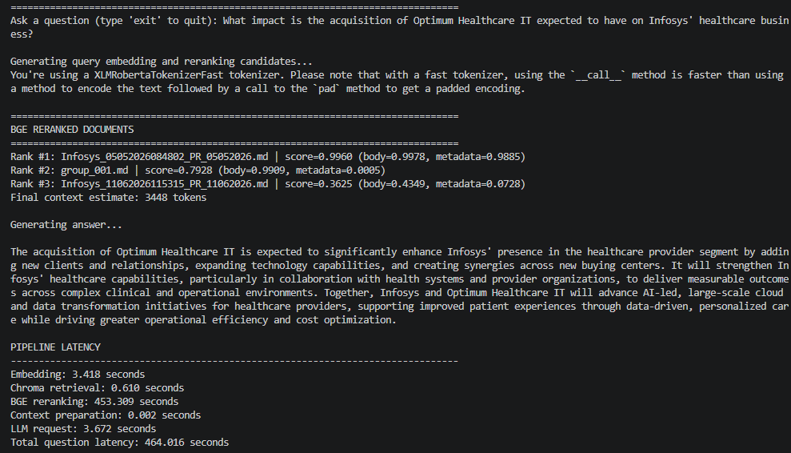
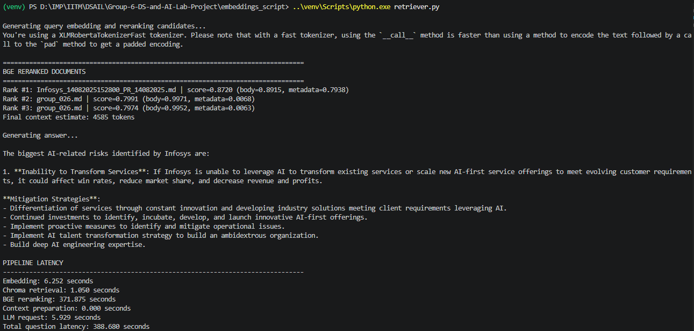
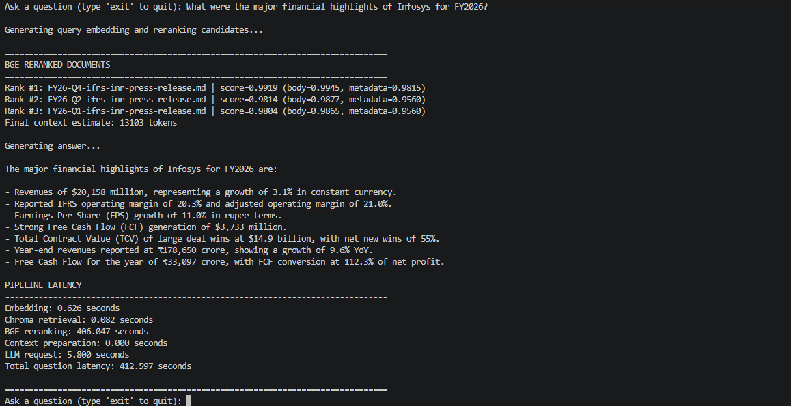

# **Data Science and AI Lab**

### **T2 - 2026**

# **FinQuery: An AI-powered, Stock-Specific Public Update Analyzer (PUA) for Indian Capital Markets**

## **Milestone-4**

**Submitted by:**

**Team 06** \
    Akbar Ali - 23f1002997 \
    Gurram Sai Sri Ram Hruthik - 22f3001648 \
    NandanReddy Parnapalli - 22f3002857 \
    Shubham Gattani - 21f3002082 \
    Shubhashish Biswas - 21f1001460

---

## **Contents**

1. [Datasets Used and Necessary Preprocessing](#1-datasets-used-and-necessary-preprocessing)
2. [Model Architecture Recap](#2-model-architecture-recap)
3. [Training Configuration](#3-training-configuration)
4. [Hyperparameter and Configuration Experiments](#4-hyperparameter-and-configuration-experiments)
5. [Generalization and Stability Techniques](#5-generalization-and-stability-techniques)
6. [Quantitative and Qualitative Results](#6-quantitative-and-qualitative-results)
7. [Sample Output from the Model](#7-sample-output-from-the-model)
8. [Training Artifacts, Scripts, and Logs](#8-training-artifacts-scripts-and-logs)
9. [Key Findings and Improvement Plan](#9-key-findings-and-improvement-plan)

---

# **1. Datasets Used and Necessary Preprocessing**

FinQuery uses a public, Infosys-specific financial corpus for retrieval-augmented question answering. The corpus combines official regulatory disclosures with investor-relations material, market news, and brokerage research.

| Source | Data Used | Role in the System |
| --- | --- | --- |
| NSE corporate announcements | Infosys filings from the last 12 months | Primary source for official disclosures |
| Infosys Investor Relations | Earnings calls, press conferences, fact sheets, and result documents | Company-reported financial and operating context |
| Yahoo Finance | News and market-related articles | Supporting market context |
| Trendlyne | Brokerage and research reports | Analyst and valuation context |
| Benchmark query set | 50 Infosys-related test questions | Retrieval and answer-quality evaluation |

The NSE source started with 240 announcement PDFs in the one-year sample. After rule-based filtering and LLM-assisted review, 137 relevant NSE documents were retained: 65 accepted by rules and 72 accepted after review. These were combined with 16 Infosys IR documents, 6 Yahoo Finance articles, and 5 Trendlyne reports.

The preprocessing pipeline was:

```text
Raw PDFs / source documents
-> PDF-to-Markdown conversion
-> renaming and deduplication
-> filtering and source selection
-> page-count based routing
-> LLM-based cleaning / knowledge extraction
-> retrieval-ready Markdown chunks
-> embedding generation
-> ChromaDB vector index
```

All PDFs were first converted to Markdown using Docling. NSE documents were then filtered using metadata categories, keyword rules, and LLM review for ambiguous cases. Documents with 10 pages or fewer were cleaned as complete documents, while 28 longer NSE documents were split into 749 heading-aware section groups before cleaning.

Source-specific prompts were used to remove non-substantive noise while preserving financial facts, tables, figures, risks, qualifications, and reported numbers. The final retrieval corpus stores each cleaned Markdown file, or each cleaned section group, as one retrievable chunk.

# **2. Model Architecture Recap**

FinQuery uses a Retrieval-Augmented Generation (RAG) architecture rather than a supervised model trained from scratch. The system retrieves relevant financial documents and then uses a language model to answer only from the retrieved context.

```text
Raw public documents
-> preprocessing
-> clean Markdown + YAML metadata
-> text-embedding-3-small
-> ChromaDB vector index
-> user query embedding
-> semantic retrieval
-> optional HyDE / BGE reranking
-> top context chunks
-> gpt-4o-mini answer generation
-> grounded response
```

| Component | Role |
| --- | --- |
| Preprocessing pipeline | Converts raw documents into clean Markdown chunks |
| YAML metadata | Stores title, description, topics, sample queries, and provenance |
| `text-embedding-3-small` | Embeds document chunks and user queries into 1536-dimensional vectors |
| ChromaDB | Stores vectors and performs semantic nearest-neighbor retrieval |
| HyDE module | Generates a hypothetical answer passage for query-side retrieval experiments |
| BGE reranker | Reranks retrieved candidates using cross-encoder relevance scoring |
| `gpt-4o-mini` | Generates final grounded answers from retrieved chunks |

At indexing time, the full cleaned Markdown chunk, including YAML front matter and body, is embedded and stored in the ChromaDB collection `finance_documents`. At query time, the user question is embedded using the same model, ChromaDB retrieves candidate chunks, and the final answer model receives the selected context with source-file headers.

For the reranking experiment, each candidate received two BGE scores:

```text
body_score     = BGE(question, document body)
metadata_score = BGE(question, YAML metadata)

final_score = 0.8 * body_score + 0.2 * metadata_score
```

# **3. Training Configuration**

FinQuery does not perform conventional neural-network training. There are no project-trained model weights, optimizer steps, loss curves, learning rates, batches, or epochs. The embedding model, reranker, and answer model are frozen pretrained models used at inference time.

| Training Item | Status in FinQuery |
| --- | --- |
| Trainable model weights | Not trained |
| Loss function | Not applicable |
| Optimizer | Not applicable |
| Learning rate | Not applicable |
| Batch size | Not applicable |
| Number of epochs | Not applicable |
| Fine-tuned checkpoints | Not generated |

The practical configuration is therefore the RAG indexing, retrieval, reranking, and generation configuration.

| Component | Configuration Used |
| --- | --- |
| Document format | Clean Markdown with YAML front matter |
| Chunking unit | One cleaned document or one cleaned section group |
| Embedding model | `text-embedding-3-small` |
| Embedding dimension | 1536 |
| Vector database | ChromaDB |
| Collection name | `finance_documents` |
| Baseline retrieval | ChromaDB HNSW semantic search |
| Baseline candidate count | Top 10 |
| Final LLM context | Top 3 chunks |
| Answer model | `gpt-4o-mini` |
| Answering rule | Answer only from retrieved context |

The main evaluation metrics were Recall@3, Recall@5, Recall@7, latency, success rate, and qualitative answer grounding. CPU hardware is sufficient for preprocessing, ChromaDB indexing, and baseline retrieval at the current corpus scale. OpenAI embedding and generation are API-based. BGE reranking can run on CPU, but GPU acceleration is recommended because CPU reranking was the main latency bottleneck.

# **4. Hyperparameter and Configuration Experiments**

Because FinQuery is a RAG system, the important hyperparameters are retrieval and pipeline settings rather than training hyperparameters.

| Setting | Values Tested |
| --- | --- |
| Retrieval strategy | Chroma-only, Chroma + HyDE, Chroma + BGE reranking |
| Candidate pool size | Top 10, Top 25 |
| Final context size | Top 3 chunks |
| Query representation | Raw query, HyDE-generated hypothetical passage |
| Reranker scoring | Body score plus metadata score |
| BGE score weighting | `0.8 * body_score + 0.2 * metadata_score` |
| Evaluation cutoffs | Recall@3, Recall@5, Recall@7 |

The three main experiments were:

| Method | Candidate Pool | Final Context | Recall@3 | Recall@5 | Recall@7 | Avg Latency |
| --- | ---: | ---: | ---: | ---: | ---: | ---: |
| Chroma only | Top 10 | Top 3 | 40% | 50% | 54% | 6.251 sec |
| Chroma + HyDE | Top 10 | Top 3 | 40% | 42% | 46% | 9.320 sec |
| Chroma + BGE reranking | Top 25 | Top 3 | 58% | 64% | 64% | 245.342 sec |

Chroma-only retrieval was the fastest and most practical baseline. HyDE did not improve recall because many benchmark questions already contained exact entity names and event terms. BGE reranking gave the best retrieval quality, improving Recall@3 from 40% to 58%, but it was too slow for an interactive chatbot without optimization.

An additional Reciprocal Rank Fusion (RRF) experiment combining raw-query retrieval and HyDE retrieval showed better results than HyDE alone.

| Method | Recall@3 | Recall@5 | Recall@7 |
| --- | ---: | ---: | ---: |
| Raw query baseline | 40% | 50% | 54% |
| HyDE only | 40% | 42% | 46% |
| Raw query + HyDE with RRF | 48% | 54% | 58% |

# **5. Generalization and Stability Techniques**

Generalization means how well the system answers new user questions that were not manually designed during development. Training stability usually means whether a model trains smoothly without unstable loss, exploding gradients, or overfitting. Since FinQuery does not train model weights, stability is interpreted as retrieval and answer-generation reliability.

| Conventional ML Term | FinQuery Equivalent |
| --- | --- |
| Generalization | Ability to answer unseen Infosys-related financial questions |
| Training stability | Stable retrieval, generation, latency, and grounding |
| Regularization | Cleaning, chunking, metadata, grounding prompts, and source control |
| Validation performance | Recall@k, latency, success rate, and qualitative faithfulness |

The main techniques used were:

| Technique | Purpose | Impact |
| --- | --- | --- |
| Multi-source corpus | Cover regulatory, company, news, and analyst perspectives | Improved answer coverage |
| Source-specific cleaning | Remove source-specific noise before embedding | Improved retrieval readiness |
| YAML metadata enrichment | Add title, description, topics, and sample queries | Improved semantic identity of chunks |
| Structure-aware chunking | Preserve related financial context | Reduced arbitrary fragmentation |
| Grounded prompting | Restrict answers to retrieved context | Reduced hallucination risk |
| Persistent ChromaDB index | Reuse the same embedded corpus across runs | Improved reproducibility |
| Benchmark logging | Track retrieved files, recall, latency, status, and errors | Made failures traceable |

BGE reranking had the strongest measured impact on retrieval accuracy, increasing Recall@3 from 40% to 58%. However, it also exposed the main stability tradeoff: higher accuracy came with much higher latency.

# **6. Quantitative and Qualitative Results**

The main evaluation used a 50-question benchmark dataset where each question had an expected source document.

| Method | Successful Queries | Recall@3 | Recall@5 | Recall@7 | Avg Latency |
| --- | ---: | ---: | ---: | ---: | ---: |
| Chroma only | 50/50 | 20/50 = 40% | 25/50 = 50% | 27/50 = 54% | 6.251 sec |
| Chroma + HyDE | 50/50 | 20/50 = 40% | 21/50 = 42% | 23/50 = 46% | 9.320 sec |
| Chroma + BGE reranking | 50/50 | 29/50 = 58% | 32/50 = 64% | 32/50 = 64% | 245.342 sec |

The best retrieval accuracy came from Chroma + BGE reranking.

| Metric | Result |
| --- | ---: |
| Recall@3 | 58% |
| Recall@5 | 64% |
| Recall@7 | 64% |
| Average latency | 245.342 sec/question |
| Median latency | 229.987 sec |
| Latency range | 185.544-454.849 sec |
| Total sequential runtime | 204.45 min |

The reranking latency breakdown was:

| Stage | Average Time |
| --- | ---: |
| Query embedding | 1.236 sec |
| Chroma retrieval | 0.089 sec |
| BGE reranking | 243.994 sec |

Source-wise Recall@3 for reranking was:

| Source Category | Recall@3 |
| --- | ---: |
| NSE <= 10 pages | 9/10 |
| NSE > 10 pages | 15/30 |
| Infosys IR | 2/5 |
| Trendlyne | 2/4 |
| Yahoo Finance | 1/1 |

Qualitatively, the chatbot produced grounded and useful answers when the correct source appeared in the final context. It handled company announcements, collaborations, CSR disclosures, investor updates, and market news well. The main weakness was long document retrieval: large section groups and table-heavy chunks often contained the answer but also had enough surrounding noise to make ranking and answer extraction harder.

# **7. Sample Output from the Model**









One representative text output from the verification run was:

# **8. Training Artifacts, Scripts, and Logs**

No trained model weights or neural checkpoints were generated because no model fine-tuning was performed. The artifacts are the cleaned corpus, vector index, benchmark outputs, scripts, prompts, and experiment notes.

| Artifact Type | Location / File | Purpose |
| --- | --- | --- |
| Cleaned NSE documents | `data/nse_files_final/whole_document_cleaning/equal_or_less_than_10_pages/` | Retrieval-ready short NSE filings |
| Sectioned long NSE files | `data/nse_files_final/knowledge_extraction/greater_than_10_pages/sectioned_files/` | Heading-aware section groups |
| Cleaned long-document sections | `data/nse_files_final/knowledge_extraction/greater_than_10_pages/cleaned_section_files/` | Retrieval-ready long-document chunks |
| Cleaned Infosys IR documents | `data/infosys_earning_calls_press_conf_fact_sheets_results/infosys_ir_earning_calls_clean_markdowns/` | Cleaned IR corpus |
| Cleaned Yahoo Finance articles | `data/yfinance/clean-mds/` | Cleaned news corpus |
| Cleaned Trendlyne reports | `data/trendlyne/clean-mds/` | Cleaned brokerage corpus |
| ChromaDB vector index | `embeddings_script/chroma_db/` | Persistent vector database |
| Benchmark input dataset | `data/infosys_rag_test_dataset_50_queries.csv` | Evaluation queries |
| Baseline benchmark results | `data/infosys_rag_test_dataset_50_queries_without_reranking_results.csv` | Chroma-only benchmark |
| HyDE benchmark results | `data/infosys_rag_test_dataset_50_queries_with_hyde_results.csv` | HyDE benchmark |
| BGE benchmark results | `data/infosys_rag_test_dataset_50_queries_with_reranking_top_25_recall_results.csv` | Reranking benchmark |
| RAGAS summary | `RAGAS/no_reranking_ragas_summary.md` | Non-reranking RAGAS summary |
| Experiment notes | `datapreparation/benchmarking/results.md` | Consolidated benchmark observations |

Important scripts include:

| Script / File | Purpose |
| --- | --- |
| `embeddings_script/index_documents.py` | Builds embeddings and stores them in ChromaDB |
| `embeddings_script/search.py` | Runs semantic search |
| `embeddings_script/retriever.py` | Retrieves context and generates answers |
| `hyde_script/hyde_retriever.py` | Implements HyDE retrieval and answering |
| `datapreparation/benchmarking/run_without_reranking_benchmark.py` | Runs the Chroma-only benchmark |
| `datapreparation/benchmarking/run_hyde_benchmark.py` | Runs the HyDE benchmark |
| `datapreparation/benchmarking/run_reranking_recall_benchmark.py` | Runs BGE reranking recall evaluation |
| `datapreparation/run-whole-doc-prompt-on-all-docs.py` | Cleans complete documents |
| `datapreparation/run-section-prompt-on-all-docs.py` | Cleans long-document section groups |
| `datapreparation/sectioner/` | Splits long NSE documents |
| `prompts/KE-prompts-for-nse-docs/` | NSE knowledge-extraction prompts |
| `prompts/KE-prompts/` | Yahoo Finance and brokerage cleaning prompts |

# **9. Key Findings and Improvement Plan**

The strongest finding is that the RAG architecture is appropriate for FinQuery because it allows the system to use fresh public disclosures without model fine-tuning. Clean Markdown, YAML metadata, and ChromaDB retrieval produced a stable baseline, and BGE reranking improved retrieval quality significantly.

| What Worked Well | Evidence |
| --- | --- |
| RAG architecture | Supports grounded answers without retraining |
| Source-specific cleaning | Reduced boilerplate and irrelevant text before embedding |
| YAML metadata | Improved each chunk's semantic representation |
| Chroma-only retrieval | Fast and stable at 6.251 sec/question |
| BGE reranking | Improved Recall@3 from 40% to 58% |

The main unexpected result was that HyDE did not help. The benchmark questions were already rich in exact entities such as partnership names, company names, and event terms. HyDE sometimes paraphrased those terms away, reducing literal match strength.

| Bottleneck | Impact |
| --- | --- |
| Large chunks near 8k tokens | Higher noise-to-signal ratio; answer may be present but harder to use |
| Large financial tables | Important rows can be buried inside broad chunks |
| Dense-only retrieval | Exact proper nouns are not always matched reliably |
| Top-3 final context | Correct documents at ranks 4 or 5 are excluded |
| BGE reranking latency | Best accuracy, but about 245 sec/question |
| Long NSE documents | Lower Recall@3 than short NSE filings |

The next improvement phase should focus on retrieval quality before changing answer generation. Smaller chunks and better table-aware chunking are the highest-priority changes because they can improve embedding quality, reduce reranker cost, and make retrieved context easier for the LLM to use.

Planned improvements:

| Improvement | Expected Benefit |
| --- | --- |
| Reduce chunk size | Lower noise-to-signal ratio and improve answer extraction |
| Improve table handling | Preserve financial tables as smaller, queryable units |
| Increase final context from top 3 to top 5 | Use correct documents that are already retrieved at ranks 4 or 5 |
| Add hybrid dense + BM25 retrieval | Capture exact entity and keyword matches |
| Add metadata/date/source filtering | Reduce irrelevant candidates before vector search |
| Test smaller reranking models | Reduce reranking latency |
| Enrich YAML metadata | Add more sample queries, entities, dates, events, and metrics |
| Increase metadata weight during reranking | Use improved metadata more strongly |
| Try metadata-only embeddings | Retrieve through metadata and map back to source chunks |
| Test `text-embedding-3-large` | Check if stronger embeddings improve recall after chunking fixes |
| Test a stronger generation model | Improve reasoning over larger or more complex context |

The recommended next architecture is:

```text
Smaller chunks
-> table-aware preprocessing
-> richer YAML metadata
-> hybrid BM25 + dense retrieval
-> metadata/date/source filtering
-> lightweight reranking
-> top-5 context
-> stronger answer model if needed
```

