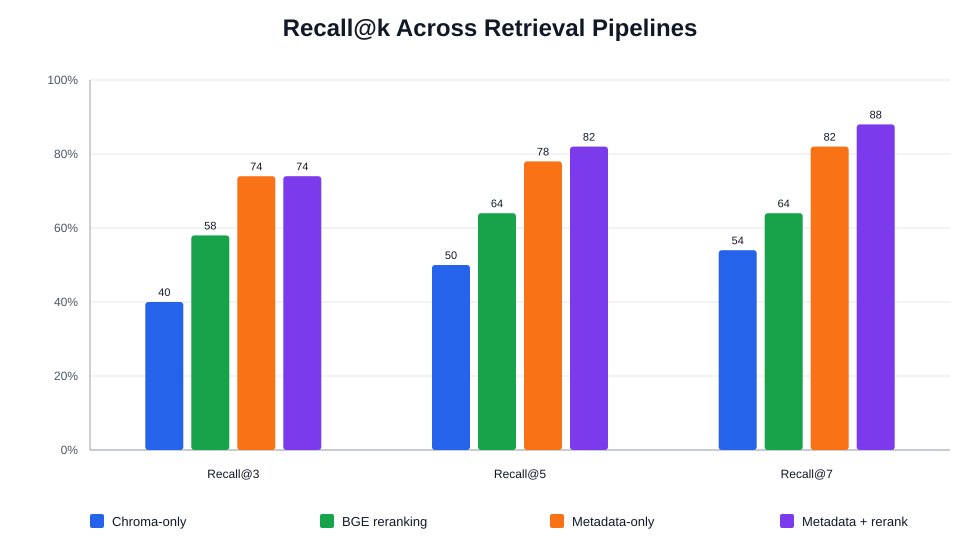
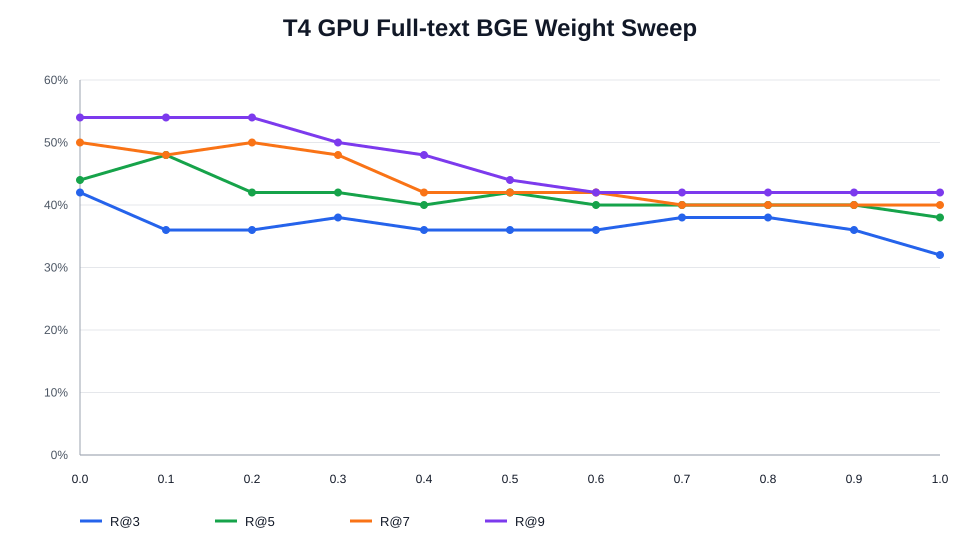
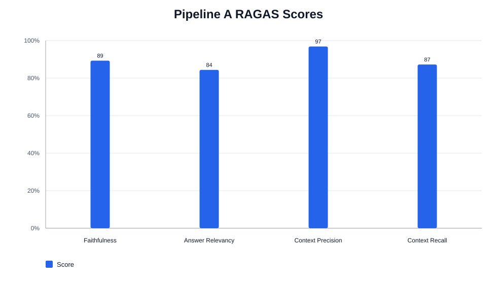
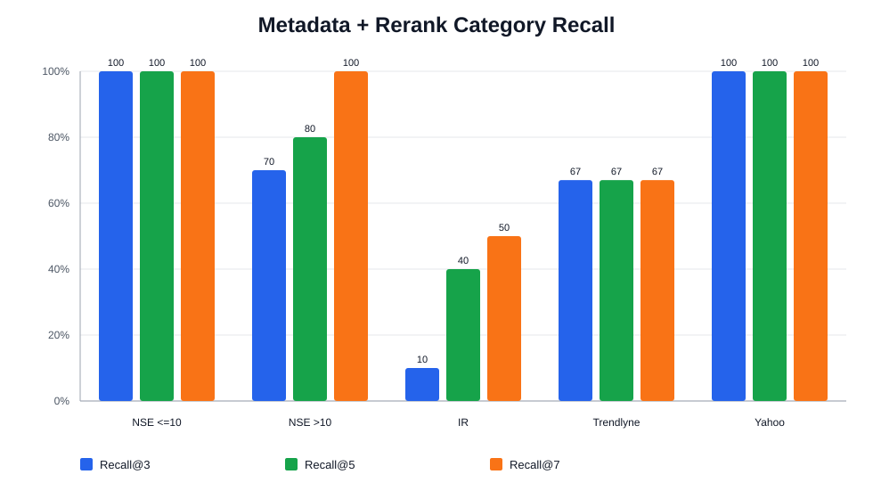

# Milestone 5 Report

# 1. Previous-Milestone Model and Pipeline

The chatbot uses a retrieval and generation pipeline built from cleaned
financial documents, vector search, optional reranking, and grounded answer
generation.

The baseline pipeline flow was:

1. Clean source financial documents into Markdown.
2. Create one embedding per cleaned Markdown document using OpenAI
   `text-embedding-3-small`.
3. Store embeddings, document text, filenames, and full source paths in
   ChromaDB.
4. Embed the user question and retrieve nearest documents.
5. Optionally apply HyDE or cross-encoder reranking.
6. Send the selected contexts to `gpt-4o-mini` to generate a grounded answer.

Milestone 5 extended this pipeline in three important ways:

- Long NSE documents and Infosys IR documents were sectioned into smaller
  1,500-2,500 token chunks, with a hard maximum of 3,000 tokens.
- A stronger section-level knowledge-extraction prompt was used to generate
  semantic YAML metadata for cleaned chunks.
- A metadata-only retrieval pipeline was created by embedding only generated
  YAML metadata, followed by a lightweight cross-encoder reranker.

The main baseline reference points were:

| Pipeline | Candidate pool | Recall@3 | Recall@5 | Recall@7 | Average latency |
|---|---:|---:|---:|---:|---:|
| Chroma-only | Top 10 | 40% | 50% | 54% | 6.251 s |
| HyDE | Top 10 | 40% | 42% | 46% | 9.320 s |
| BGE reranking | Top 25 | 58% | 64% | 64% | 245.342 s |

# 2. Evaluation Dataset

A single 50-question evaluation dataset was used for Milestone 5 retrieval and
answer-quality benchmarking. The dataset maps every question to the expected
source document path, which makes the Recall@k calculation strict and
repeatable.

The source-category distribution is:

| Source category | Questions |
|---|---:|
| NSE documents <=10 pages | 24 |
| NSE documents >10 pages | 10 |
| Infosys IR | 10 |
| Trendlyne | 3 |
| Yahoo Finance | 3 |
| Total | 50 |

The dataset uses full relative file paths as the ground truth. This avoids
ambiguity between repeated chunk names such as `group_001.md` across different
document folders.

# 3. Evaluation Environment

The evaluation used these models and runtime components:

| Component | Configuration |
|---|---|
| Embedding model | OpenAI `text-embedding-3-small` |
| Answer-generation model | OpenAI `gpt-4o-mini` |
| RAGAS evaluator model | `gpt-5.6-luna` |
| Full-text BGE reranker | `BAAI/bge-reranker-v2-m3` |
| Metadata cross-encoder | `cross-encoder/ms-marco-MiniLM-L-6-v2` |
| Vector database | ChromaDB persistent collections |
| YAML parsing | PyYAML |
| Local runtime | Python virtual environment |
| GPU runtime | Google Colab T4 GPU |

The full-text Chroma collection contains 1,877 Markdown embeddings from the
approved source folders. After YAML quoting repairs, all 1,877 documents were
re-embedded using `text-embedding-3-small`.

The metadata-only collection contains 1,875 embedded metadata documents. Two
files had empty YAML metadata and were skipped by that specialized pipeline.

No answer-generation calls were made for the Recall@k-only benchmarks. The
RAGAS pipeline used `gpt-4o-mini` for answer generation and `gpt-5.6-luna` for
RAGAS evaluation.

# 4. Performance Metrics

Recall@k is the primary retrieval metric. It measures whether the expected
source document appears among the top `k` retrieved or reranked candidates.

For full-text retrieval experiments, Recall@3, Recall@5, Recall@7, and
Recall@9 were measured. For metadata-only retrieval experiments, Recall@3,
Recall@5, and Recall@7 were measured.

Latency was measured per question where reported. For reranking pipelines, the
reranking component was also tracked separately because reranking is often the
main performance bottleneck.

For end-to-end answer quality, RAGAS metrics were used:

- `faithfulness`: whether the answer is supported by the retrieved context.
- `answer_relevancy`: whether the answer addresses the question.
- `context_precision`: whether retrieved context is relevant to the question.
- `context_recall`: whether the retrieved context contains the information
  needed for the reference answer.

# 5. Quantitative Results

## Full-Text Pipeline

The rebuilt full-text corpus includes smaller section-aware chunks for long NSE
documents and Infosys IR documents. Chroma-only retrieval remained fast, while
BGE reranking improved recall at each measured cutoff but was expensive on CPU.

| Pipeline | Candidate pool | Recall@3 | Recall@5 | Recall@7 | Recall@9 |
|---|---:|---:|---:|---:|---:|
| Chroma-only | Top 10 | 34% | 38% | 40% | 40% |
| BGE reranking | Top 35 | 40% | 46% | 50% | 56% |

The 35-candidate BGE run improved over Chroma-only by 6, 8, 10, and 16
percentage points at k = 3, 5, 7, and 9. On CPU, the same run averaged
486.439 seconds per question, including embedding and Chroma retrieval.

## Metadata-Only Pipeline

The metadata-only pipeline embeds concise semantic metadata generated during
knowledge extraction: `section_title`, `section_description`, `topics`, and
`sample_queries`.

| Pipeline | Retrieval pool | Recall@3 | Recall@5 | Recall@7 | Average latency |
|---|---:|---:|---:|---:|---:|
| Metadata-only embedding | Top 10 | 74% | 78% | 82% | 0.478 s |
| Metadata-only + cross-encoder reranking | Top 20 | 74% | 82% | 88% | 3.173 s |

The cross-encoder reranker kept Recall@3 unchanged while improving Recall@5 by
4 percentage points and Recall@7 by 6 percentage points. Its average reranking
component was 1.738 seconds per question.

Category-level metadata + rerank recall:

| Source category | Recall@3 | Recall@5 | Recall@7 |
|---|---:|---:|---:|
| NSE documents <=10 pages | 100% | 100% | 100% |
| NSE documents >10 pages | 70% | 80% | 100% |
| Infosys IR | 10% | 40% | 50% |
| Trendlyne | 67% | 67% | 67% |
| Yahoo Finance | 100% | 100% | 100% |

## Full-Text GPU Weight Sweep

The Colab notebook used a T4 GPU to evaluate 35 retrieved Chroma candidates for
all 50 questions. It varied body score weight from 0.0 to 1.0 with step size
0.1; metadata weight was set to `1 - body_weight`.

| Body weight | Metadata weight | Recall@3 | Recall@5 | Recall@7 | Recall@9 |
|---:|---:|---:|---:|---:|---:|
| 0.0 | 1.0 | 42% | 44% | 50% | 54% |
| 0.1 | 0.9 | 36% | 48% | 48% | 54% |
| 0.2 | 0.8 | 36% | 42% | 50% | 54% |
| 0.3 | 0.7 | 38% | 42% | 48% | 50% |
| 0.4 | 0.6 | 36% | 40% | 42% | 48% |
| 0.5 | 0.5 | 36% | 42% | 42% | 44% |
| 0.6 | 0.4 | 36% | 40% | 42% | 42% |
| 0.7 | 0.3 | 38% | 40% | 40% | 42% |
| 0.8 | 0.2 | 38% | 40% | 40% | 42% |
| 0.9 | 0.1 | 36% | 40% | 40% | 42% |
| 1.0 | 0.0 | 32% | 38% | 40% | 42% |

The best configuration by cutoff was:

- Recall@3: body 0.0, metadata 1.0, at 42%.
- Recall@5: body 0.1, metadata 0.9, at 48%.
- Recall@7: body 0.0 or 0.2, at 50%.
- Recall@9: body 0.0, 0.1, or 0.2, at 54%.

The T4 GPU run took 29.429 seconds to load the model, 3.278 seconds mean
reranking time per question, and 3.695 seconds mean end-to-end time. The
latencies were identical across weight pairs because body and metadata scores
were computed once and reused for every weighted sort.

## RAGAS Answer-Quality Results

Pipeline A used metadata-only top-10 retrieval, selected the top three context
documents, and generated answers with `gpt-4o-mini`. RAGAS evaluation used
`gpt-5.6-luna`.

| Metric | Pipeline A score |
|---|---:|
| Faithfulness | 0.8929 |
| Answer relevancy | 0.8439 |
| Context precision | 0.9683 |
| Context recall | 0.8725 |

# 6. Task-Specific Visualizations

The following visualizations summarize the main retrieval and answer-quality
results.

This chart compares the main Recall@k values across the baseline full-text
pipelines and the Milestone 5 metadata pipelines. Metadata-only retrieval is
the strongest overall retrieval approach, and metadata + rerank gives the best
Recall@7.

This chart shows that full-text BGE reranking performed best when the score was
metadata-heavy. Pure body scoring was the weakest configuration in this sweep.

The RAGAS chart shows strong context precision and faithfulness. Context recall
and answer relevancy are slightly lower, mostly because of missed supporting
chunks and some long-answer evaluation artifacts.

The category chart shows that retrieval is strongest for distinctive short NSE
documents, Yahoo Finance documents, and most long NSE sections. Infosys IR is
the weakest category because quarterly documents share very similar language.

# 7. Qualitative Results

The qualitative review focused on Pipeline A: metadata-only retrieval with
top-3 context documents and `gpt-4o-mini` answer generation.

Successful cases usually had one of these properties:

- The source document had distinctive entities, such as Intel, Bank CTBC
  Indonesia, or a specific buyback filing.
- The question asked for a precise single-source fact, such as large-deal TCV
  and net-new percentage.
- The relevant context was compact enough to fit inside the top three
  retrieved chunks.

Representative successes:

| ID | Source type | Reason for success | Result |
|---:|---|---|---|
| 9 | Infosys IR Q3 FY26 earnings call | Single factual query about large-deal TCV and net-new share | Correctly answered `$4.8 billion` and `57%` |
| 22 | NSE short press release | Distinctive Infosys-Intel partnership metadata | Fully grounded strategic answer |
| 17 | NSE buyback filing | Unique numerical regulatory facts | Correctly returned buyback size, price, and share count |
| 24 | Infosys Finacle press release | Unique bank name and product context | Correctly summarized business and performance benefits |

Failure cases were more concentrated in documents that share similar financial
vocabulary or require evidence spread across multiple chunks.

Representative failures:

| ID | Source type | Failure pattern | Observed issue |
|---:|---|---|---|
| 46 | NSE AGM transcript | Wrong year / wrong document | Answer used FY26 large-deal value instead of FY24-25 value |
| 15 | Infosys IR Q2 FY26 press release | Multi-chunk fragmentation | Answer listed only 3 recognitions when 8 were expected |
| 13 | Infosys IR Q4 FY26 earnings call | LLM over-elaboration | Correct context was present, but the answer added unsupported rationale |
| 8 | Infosys IR Q1 FY26 earnings call | RAGAS answer-relevancy artifact | Faithful answer received 0 answer relevancy due to metric behavior |
| 34 | NSE Responsible AI press release | Semantic vocabulary collision | Retrieved generic Form 20-F AI risk chunks instead of the specific research PR |

The qualitative results confirm that the pipeline performs well when metadata
contains distinctive names, events, and numerical anchors. It struggles when
multiple documents use the same vocabulary but differ by quarter, fiscal year,
or exact numerical value.

# 8. Error Analysis

## Infosys IR ambiguity

Infosys IR is the hardest category. Earnings calls, press conferences, fact
sheets, and quarterly result documents repeat terms such as revenue guidance,
operating margin, constant-currency growth, large-deal TCV, utilization, and
attrition. The metadata-only pipeline often identifies the correct document
family but not the exact quarter.

The practical effect is that a question about Q1 can retrieve a Q3 or Q4
document if the metadata vocabulary is nearly identical. The answer model may
then use the wrong quarter's number while still sounding relevant.

## Long NSE section boundaries

Long NSE documents were converted into many cleaned section chunks. This made
the documents easier to retrieve and pass into context, but some questions
need evidence from adjacent chunks in the same original document.

For list-style questions, retrieving one correct chunk may not be enough. If
the answer spans `group_001.md`, `group_002.md`, and `group_003.md`, a top-3
context can still miss part of the answer.

## Reranking candidate ceiling

Reranking can only reorder candidates that Chroma already retrieved. If the
expected source document is absent from the initial candidate pool, the
reranker cannot recover it.

This matters for both full-text and metadata-only reranking. The full-text GPU
experiment used 35 Chroma candidates, while the metadata-only cross-encoder
experiment used 20 candidates.

## YAML metadata effects

The original cleaned files for NSE >10-page and Infosys IR chunks contained
two YAML blocks. The first block was structural metadata, while the second
block contained semantic knowledge-extraction metadata.

The reranker was updated to parse the second semantic YAML block for these two
source categories. For all other source categories, it keeps the original
single-YAML-block behavior. This avoids breaking short NSE, Yahoo Finance, and
Trendlyne documents that only have one YAML block.

## Body scoring limitations

The full-text BGE body score includes Markdown bodies with tables, repeated
headers, boilerplate, and heterogeneous section text. Long bodies may also be
truncated by the reranker input limit. In contrast, the metadata score is
shorter and more directly aligned with the question intent.

This explains why the T4 GPU sweep favored metadata-heavy scoring.

# 9. Key Observations, Limitations, and Anomalies

Key observations:

- Section-aware chunking created cleaner retrieval units for long NSE and
  Infosys IR documents.
- Full corpus embeddings were regenerated for 1,877 Markdown documents after
  YAML fixes.
- Full-text BGE reranking improved over Chroma-only retrieval, but CPU latency
  was too high for interactive use.
- Running full-text BGE on a Colab T4 GPU reduced reranking latency to about
  3.278 seconds per question.
- Metadata-only retrieval achieved 74%, 78%, and 82% at Recall@3, @5, and @7
  with only 0.478 seconds average latency.
- Metadata-only cross-encoder reranking improved Recall@5 to 82% and
  Recall@7 to 88% with 3.173 seconds average total latency.
- Pipeline A RAGAS scores were strong: faithfulness 0.8929, answer relevancy
  0.8439, context precision 0.9683, and context recall 0.8725.

Limitations:

- Infosys IR documents remain hard to disambiguate because many quarterly
  documents use similar language.
- Some long-document questions require adjacent chunk retrieval, especially
  list-style questions whose evidence spans multiple section chunks.
- The full-text BGE and metadata-only cross-encoder pipelines use different
  reranker models and candidate-pool sizes.
- RAGAS answer relevancy can under-score long but faithful answers because of
  how the metric reconstructs synthetic questions from generated answers.
- Pipeline B RAGAS evaluation was not completed in the supplied results.

Overall conclusion:

The best speed-quality tradeoff demonstrated in Milestone 5 is metadata-only
retrieval with lightweight cross-encoder reranking. It gives the strongest
Recall@7 result, keeps latency practical, and performs especially well on
documents with distinctive semantic metadata. The main remaining improvement
area is Infosys IR disambiguation, where quarter, fiscal year, and exact
financial values should be made more explicit in the retrieval signal.
