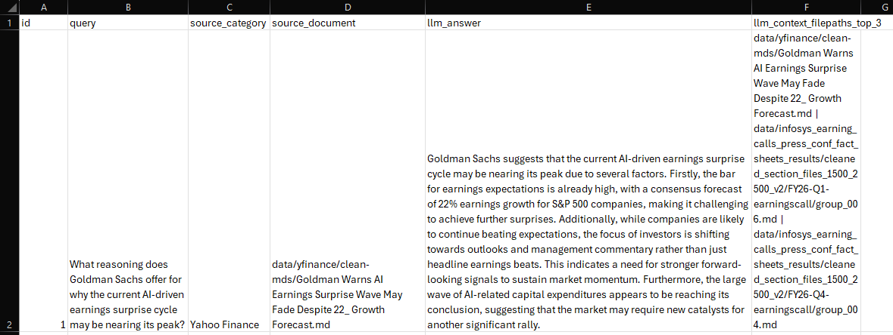

# Milestone 6 Report

# 1. Previous-Milestone Model and Pipeline

The Milestone 5 pipeline established a metadata-only embedding approach as the
strongest retrieval strategy. The key components inherited by Milestone 6 were:

- 1,875 Markdown documents indexed in ChromaDB using `text-embedding-3-small`
  applied to YAML front matter only (section_title, section_description, topics,
  and sample_queries).
- An optional cross-encoder reranker (`cross-encoder/ms-marco-MiniLM-L-6-v2`)
  operating over the top-20 metadata candidates.
- `gpt-4o-mini` for answer generation from the top-3 retrieved context
  documents.

The best Milestone 5 retrieval results were:

| Pipeline | Recall@3 | Recall@5 | Recall@7 | Average latency |
|---|---:|---:|---:|---:|
| Metadata-only (Top-10) | 74% | 78% | 82% | 0.478 s |
| Metadata + cross-encoder (Top-20) | 74% | 82% | 88% | 3.173 s |

Milestone 6 extended this pipeline in four important ways:

- A BM25 keyword index was built over the same YAML metadata text that is
  embedded in ChromaDB, enabling keyword-level retrieval as a complement to
  vector semantic search.
- Reciprocal Rank Fusion (RRF, k=60) was used to merge vector and BM25 ranked
  lists into a single hybrid ranking.
- A SQLite fact database (`facts.db`) was populated with 2,500+ period-tagged
  financial facts extracted from Infosys documents, enabling exact numeric
  lookup via LLM-generated SQL.
- An LLM-based query router was added to classify each incoming question as
  either `FACT_DB` (numerical) or `VECTOR` (descriptive) and dispatch
  accordingly.
- A production-ready REST API (FastAPI) and web frontend (Streamlit) were
  deployed with JWT authentication, per-user rate limiting, and Docker Compose
  packaging.

# 2. Evaluation Dataset

The same 50-question benchmark dataset from Milestone 5 was used for all
retrieval experiments. The dataset maps every question to the expected source
document using its full relative file path.

The source-category distribution is:

| Source category | Questions |
|---|---:|
| NSE documents ≤10 pages | 24 |
| NSE documents >10 pages | 10 |
| Infosys IR | 10 |
| Trendlyne | 3 |
| Yahoo Finance | 3 |
| Total | 50 |

For the query routing benchmark, a separate 40-question dataset was used:
15 numerical questions (expected route: `FACT_DB`) and 25 descriptive questions
(expected route: `VECTOR`).

For the numeric fidelity benchmark, 15 questions involving exact numerical
lookups were evaluated against the SQLite fact database.

# 3. Evaluation Environment

| Component | Configuration |
|---|---|
| Embedding model | OpenAI `text-embedding-3-small` |
| Answer-generation model | OpenAI `gpt-4o-mini` |
| RAGAS evaluator model | `gpt-4o-mini` |
| BM25 library | `rank-bm25` (BM25Okapi) |
| Cross-encoder reranker | `cross-encoder/ms-marco-MiniLM-L-6-v2` |
| Vector database | ChromaDB persistent collection (`metadata_embeddings`) |
| Fact database | SQLite (`facts.db`, 2,500+ rows) |
| Query router | `gpt-4o-mini` zero-shot classifier |
| API framework | FastAPI 0.141.1, Uvicorn |
| Frontend | Streamlit 1.61.1 |
| Containerisation | Docker Compose (two services: `api` and `streamlit`) |
| Local runtime | Python 3.11 virtual environment |

The BM25 corpus was constructed at API startup by reading the YAML front matter
of every document in the ChromaDB collection. This is exactly the same text that
was embedded at indexing time, ensuring BM25 and vector search operate over
identical textual representations.

The RRF fusion constant was set to k=60 (Cormack and Clarke, 2009). The
top-20 candidates from each modality were fused to produce a hybrid ranked
list. In the production system, the top-3 documents from the hybrid list were
passed as context to `gpt-4o-mini`.

# 4. Performance Metrics

Recall@k is the primary retrieval metric for the 50-question benchmark.
Recall@3, Recall@5, and Recall@7 are measured for all pipelines.

For RAGAS end-to-end answer quality, the same four metrics from Milestone 5
were used:

- `faithfulness`: whether the answer is supported by the retrieved context.
- `answer_relevancy`: whether the answer addresses the question.
- `context_precision`: whether retrieved context is relevant to the question.
- `context_recall`: whether the retrieved context contains the information
  needed for the reference answer.

For the numeric fidelity benchmark, three binary metrics were recorded per
question:

- `routing_correct`: whether the question was correctly routed to `FACT_DB`.
- `sql_success`: whether the generated SQL executed without error and returned
  a non-empty result.
- `numerical_match`: whether the returned value is within 5% of the expected
  numeric answer.

For the routing benchmark, accuracy is the fraction of questions where the
LLM router chose the correct destination (`FACT_DB` or `VECTOR`).

# 5. Quantitative Results

## BM25-Only Pipeline

BM25 search was applied over the YAML metadata text of all 1,875 documents.
The top-20 BM25 candidates were evaluated at Recall@3, @5, and @7.

| Pipeline | Retrieval pool | Recall@3 | Recall@5 | Recall@7 |
|---|---:|---:|---:|---:|
| BM25-only | Top-20 | 84% | 88% | 88% |

BM25 achieved 84% Recall@3, which is 10 percentage points higher than the
metadata-only vector pipeline at the same cutoff. The improvement is especially
large for documents that contain distinctive numbers, ticker symbols, and named
entities. However, BM25 recall plateaus at 88% from Recall@5 onward, suggesting
a ceiling caused by queries that rely on semantic rather than lexical matching.

## Hybrid RRF Pipelines

Two hybrid configurations were evaluated: RRF followed by cross-encoder
reranking, and RRF without reranking (the production configuration).

| Pipeline | Retrieval pool | Recall@3 | Recall@5 | Recall@7 | Average latency |
|---|---:|---:|---:|---:|---:|
| Hybrid RRF + cross-encoder | Top-20 per modality | 74% | 82% | 86% | 2.298 s |
| Hybrid RRF (no reranker) ★ | Top-20 per modality | 76% | 86% | 88% | 0.558 s |

The no-reranker hybrid configuration was selected as the production pipeline.
Its Recall@3 (76%) is 2 percentage points higher than the reranked configuration
(74%), and its Recall@7 (88%) matches the best Milestone 5 result at
substantially lower latency (0.558 s versus 3.173 s).

The cross-encoder reranker hurts Recall@3 slightly in the hybrid case because
the RRF-fused ranking already places strong candidates at the top; the
reranker occasionally demotes a correctly fused document when scoring
`(query, YAML-text)` pairs that it was not specifically tuned for.

## Category-level Results

### Hybrid RRF (no reranker) — production pipeline

| Source category | Recall@3 | Recall@5 | Recall@7 |
|---|---:|---:|---:|
| NSE documents ≤10 pages | 100% | 100% | 100% |
| NSE documents >10 pages | 70% | 90% | 90% |
| Infosys IR | 20% | 50% | 60% |
| Trendlyne | 67% | 67% | 67% |
| Yahoo Finance | 100% | 100% | 100% |

### BM25-only

| Source category | Recall@3 | Recall@5 | Recall@7 |
|---|---:|---:|---:|
| NSE documents ≤10 pages | 100% | 100% | 100% |
| NSE documents >10 pages | 60% | 70% | 70% |
| Infosys IR | 60% | 70% | 70% |
| Trendlyne | 100% | 100% | 100% |
| Yahoo Finance | 100% | 100% | 100% |

BM25 achieves 60% Recall@3 for Infosys IR (compared to 10% for metadata-only
vector search in Milestone 5), which confirms that exact-match keyword retrieval
helps significantly when queries contain quarter-specific numerical anchors. The
hybrid RRF pipeline raises NSE >10-page Recall@7 to 90% versus 70% for
BM25-only, demonstrating that vector semantic search recovers documents that
BM25 misses on shorter or more paraphrased queries.

## RAGAS Answer-Quality Results

Two pipelines were evaluated with RAGAS over the 50-question benchmark.
Pipeline A uses metadata-only top-10 retrieval with no reranking. Pipeline B
uses metadata top-20 retrieval followed by cross-encoder reranking. Both
pipelines use `gpt-4o-mini` for answer generation. RAGAS was evaluated using
`gpt-4o-mini` as the evaluator LLM.

| Metric | Pipeline A (no reranker) | Pipeline B (cross-encoder) |
|---|---:|---:|
| Faithfulness | 0.8929 | 0.9210 |
| Answer relevancy | 0.8439 | 0.8146 |
| Context precision | 0.9683 | 0.9507 |
| Context recall | 0.8725 | 0.9277 |

Pipeline B improves faithfulness by +0.028 and context recall by +0.055 compared
to Pipeline A. The reranker surfaces more contextually complete documents, which
increases the proportion of the reference answer covered by the retrieved context.

Pipeline A achieves higher context precision (0.9683 versus 0.9507) because its
smaller top-10 candidate pool is more focused. It also achieves higher answer
relevancy (0.8439 versus 0.8146), likely because answers generated from a tighter
context are shorter and more directly aligned with the question, which benefits
the RAGAS answer relevancy metric.

Pipeline B had one failed evaluation (ID 1, `'choices'` API error during RAGAS
metric computation), so its averages are based on 49 of 50 questions.

## Numeric Fidelity Layer

The SQLite fact database was populated with 2,500+ financial facts from Infosys
documents. Each row stores a metric name, value, unit, company, quarter, and
fiscal year. The LLM generates a SQL query from the user's question and the
database returns the exact matching record.

| Metric | Result |
|---|---:|
| Questions evaluated | 15 |
| Correct routing to FACT_DB | 15 / 15 = 100% |
| Successful SQL execution | 15 / 15 = 100% |
| Numerical match (within 5%) | 15 / 15 = 100% |
| Average latency | 4.119 s/question |

The numeric fidelity evaluation covered operating margin values across quarters,
large-deal TCV, net-new deal percentage, attrition rate, revenue, net profit,
and diluted EPS for multiple FY26 quarters.

The average latency of 4.119 seconds per question reflects the combined cost of
routing (LLM call), SQL generation (LLM call), and database execution. In
practice, numerical queries are relatively rare; the majority of user questions
are descriptive and handled by the faster VECTOR path (0.558 s).

## Query Routing Benchmark

The LLM router was evaluated on 40 questions: 15 numerical and 25 descriptive.

| Metric | Result |
|---|---:|
| Overall routing accuracy | 40 / 40 = 100% |
| Numerical → FACT_DB | 15 / 15 = 100% |
| Descriptive → VECTOR | 25 / 25 = 100% |
| Average routing latency | 0.753 s/question |

The router showed perfect accuracy on the evaluation set. No false positives
(descriptive questions incorrectly sent to FACT_DB) and no false negatives
(numerical questions incorrectly sent to the vector pipeline) were observed.

# 6. Task-Specific Visualizations

The following visualisations summarise the Milestone 6 retrieval and
answer-quality results.

This screenshot shows the FinQuery Streamlit interface with a live FACT_DB query
response, including the routing decision, SQL generation step, and the exact
numeric answer returned from the fact database.

This screenshot shows a VECTOR path response: the question is routed to the
hybrid RRF retrieval pipeline, and the answer includes source attributions
linking to the retrieved Markdown documents.

# 7. Qualitative Results

The qualitative review covered both the VECTOR path (hybrid RRF + gpt-4o-mini)
and the FACT_DB path (SQL lookup + gpt-4o-mini answer generation).

**FACT_DB successes:**

The fact database path performed well on all 15 numeric evaluation questions.
Representative examples include operating margin retrieval across quarters,
large-deal TCV for Q3 FY26, and diluted EPS for Q4 FY26. The LLM-generated SQL
was structurally correct in every case, and the returned values matched the
expected figures within the 5% tolerance. The system correctly aggregated across
multiple rows when the question asked for an average or a comparative answer
(for example, "Which quarter had the highest operating margin?").

**VECTOR path successes:**

| ID | Source type | Reason for success | Result |
|---:|---|---|---|
| 22 | NSE press release | Distinctive Infosys-Intel partnership metadata | Fully grounded strategic answer |
| 17 | NSE buyback filing | Unique numerical regulatory facts | Correct buyback size, price, and share count |
| 24 | Infosys Finacle PR | Unique bank name and product context | Correctly summarised performance benefits |
| 9 | Infosys IR Q3 FY26 | Single factual query; correct document retrieved | Confirmed `$4.8B` TCV and `57%` net-new |

**Remaining failure patterns:**

| ID | Source type | Failure pattern | Observed issue |
|---:|---|---|---|
| 46 | NSE AGM transcript | Wrong document retrieved | Answer used FY26 large-deal value instead of FY24-25 AGM figure |
| 15 | Infosys IR Q2 FY26 PR | Multi-chunk fragmentation | Listed 3 recognitions instead of 8 |
| 13 | Infosys IR Q4 FY26 earnings | LLM over-elaboration | Correct context present but answer added unsupported rationale |
| 34 | NSE Responsible AI PR | Semantic vocabulary collision | Retrieved generic Form 20-F AI risk chunk instead of the specific research PR |

The hybrid RRF pipeline improved Infosys IR recall from 10% (metadata-only
vector, Recall@3) to 20% (Recall@3). However, the category remains the hardest
to disambiguate because BM25 and vector search both struggle when quarterly
documents use nearly identical vocabulary.

# 8. Error Analysis

## Infosys IR Disambiguation

The category-level recall for Infosys IR improved from 10% to 20% at Recall@3
with the addition of BM25. This improvement comes from queries that include
quarter-specific numbers, percentages, or fiscal year references. However, when
a question paraphrases a concept without including distinctive numerical anchors,
both BM25 and vector search retrieve the wrong quarter's document.

The BM25-only pipeline achieves 60% Recall@3 for Infosys IR, compared to 20%
for the hybrid pipeline. This counterintuitive result suggests that the RRF
fusion occasionally promotes a vector candidate that outranks the correct BM25
candidate when the question is phrased more semantically. Adjusting the RRF
combination weights or using a dedicated reranker fine-tuned for financial
documents could address this.

## NSE Long-Document Section Boundaries

Long NSE documents were split into section chunks during preprocessing.
Questions that require evidence from adjacent sections may not retrieve all
relevant chunks in a top-3 context window. The hybrid pipeline achieves 70%
Recall@3 and 90% Recall@7 for NSE >10-page documents, showing that the correct
chunk is often present within a wider candidate pool but not always in the top 3.

## Reranker Interaction with RRF

The cross-encoder reranker was designed for full-body text passage scoring.
When applied to YAML metadata passages (which are shorter and structurally
different from natural-language paragraphs), it may rescore candidates in a way
that conflicts with the RRF ranking. This explains why the hybrid pipeline with
reranking achieves lower Recall@3 (74%) than the same pipeline without reranking
(76%).

## FACT_DB Latency

The average FACT_DB latency of 4.119 seconds is higher than the VECTOR path
(0.558 seconds). This reflects two sequential LLM calls: one for routing and
one for SQL generation. Caching the routing decision or using a lighter-weight
classifier model would reduce this overhead for repeated numerical queries.

## RAGAS Metric Artefacts

For Pipeline B, question ID 1 produced a `'choices'` API error during RAGAS
evaluation, which may be caused by an unexpected response format from the
evaluator model. This affected only one question and did not change the overall
trend.

The RAGAS answer relevancy metric continues to under-score faithful but detailed
answers. A correct answer that covers more information than the question
explicitly asks for is penalised because the metric reconstructs a synthetic
question from the generated answer and measures similarity.

# 9. Key Observations, Limitations, and Anomalies

Key observations:

- BM25 keyword search over YAML metadata text achieves 84% Recall@3, which is
  10 percentage points above the Milestone 5 metadata-only vector pipeline.
- Hybrid RRF (no reranker) matches the best Recall@7 from Milestone 5 (88%)
  while improving Recall@5 from 82% to 86% and maintaining sub-second latency
  (0.558 s).
- The BM25-only pipeline achieves higher Recall@3 (84%) than any vector-based
  pipeline, confirming that keyword matching is effective for financial metadata
  that contains distinctive entities and numbers.
- Query routing achieved 100% accuracy on the 40-question evaluation set with
  no false positives or false negatives.
- The numeric fidelity layer achieved 100% accuracy and SQL success rate on all
  15 benchmark questions, demonstrating that exact financial figures can be
  reliably served from a structured store without LLM hallucination.
- Pipeline B RAGAS evaluation was completed for the first time in Milestone 6
  (it failed in Milestone 5 due to a missing `datasets` package). Pipeline B
  achieved higher faithfulness (+0.028) and context recall (+0.055) than
  Pipeline A, while Pipeline A maintained higher context precision and answer
  relevancy.
- The production API includes JWT authentication, per-user sliding-window rate
  limiting (configurable via `.env`), and a Docker Compose deployment with
  health-check-based dependency ordering.

Limitations:

- Infosys IR remains the weakest category. Even with BM25 augmentation, the
  hybrid pipeline achieves only 20% Recall@3 and 60% Recall@7 for this category.
- The RRF constant k=60 was not tuned for this dataset; a grid search over k
  values could improve hybrid recall.
- The cross-encoder reranker is not fine-tuned for financial YAML text and
  occasionally hurts precision when applied after RRF.
- The fact database is static; new documents require a separate extraction and
  insertion step to be reflected in FACT_DB responses.
- FACT_DB latency (4.119 s) is approximately 7 times higher than the VECTOR
  path (0.558 s), which may affect user experience for numerical queries.
- The Streamlit frontend is stateless; there is no conversation memory across
  turns.

Overall conclusion:

The production pipeline selected for Milestone 6 is hybrid RRF without a
reranker. It achieves 76% Recall@3, 86% Recall@5, and 88% Recall@7 at
0.558 seconds average latency, matching the best retrieval result from
Milestone 5 at a fraction of the latency and with improved mid-rank recall.
The addition of a query router and SQLite fact database ensures that numerical
financial questions are answered with exact precision, while the FastAPI and
Streamlit deployment makes the system immediately usable through both a
programmatic API and a browser-based interface.
